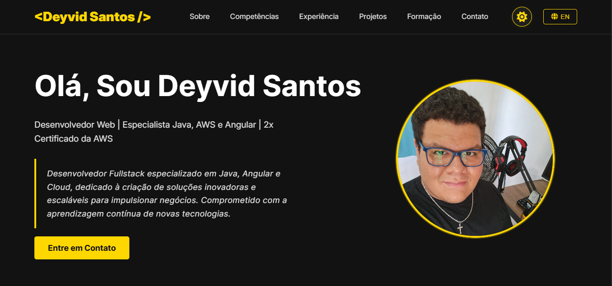

# Personal Portfolio - Deyvid Santos

This project is a fully responsive Single Page Application built with pure HTML, CSS, and JavaScript to showcase my skills, experience, and projects.

---

## 🌎 Table of Contents / Sumário

-   [**🇧🇷 Versão em Português**](#-versão-em-português)
-   [**🇺🇸 English Version**](#-english-version)

---

## 🇧🇷 Versão em Português



Bem-vindo ao repositório do meu portfólio pessoal! Este projeto é uma página única (Single Page Application) totalmente responsiva, construída com HTML, CSS e JavaScript puros para mostrar minhas competências, experiência e projetos.

### 🎯 Objetivo do Projeto

Este portfólio foi desenvolvido como uma atividade prática para o programa **Bolsa Futuro Digital (BFD) da Softex**. O principal objetivo é aplicar e demonstrar de forma consolidada as habilidades de desenvolvimento front-end adquiridas durante a formação, abrangendo desde a estruturação semântica com HTML5, estilização avançada com CSS3, até a manipulação dinâmica e interativa com JavaScript (ES6+).

### ✨ Features Principais

-   **Design Moderno e Responsivo**: Layout elegante que se adapta perfeitamente a desktops, tablets e celulares.
-   **Multi-idioma (i18n)**: Suporte completo para Português (pt-BR) e Inglês (en), com conteúdo carregado dinamicamente a partir de arquivos JSON.
-   **Seletor de Tema (Light/Dark Mode)**: Permite ao usuário escolher entre um tema claro e um escuro. A preferência é salva no navegador e também detecta o tema padrão do sistema operacional.
-   **Carregamento Dinâmico de Projetos**: A seção de projetos é populada a partir de um arquivo JSON, com sistema de paginação para uma navegação fluida.
-   **Formulário de Contato Funcional**: Inclui validação de campos em tempo real e integração com o [Formspree](https://formspree.io/) para envio de e-mails.
-   **Animações sutis**: Efeitos de "scroll reveal" que animam as seções conforme o usuário rola a página.
-   **Acessibilidade**: Uso de tags semânticas e textos alternativos para uma melhor experiência com leitores de tela.

### 🚀 Tecnologias Utilizadas

-   **HTML5**: Para a estrutura semântica do conteúdo.
-   **CSS3**: Para estilização, layout (Flexbox & Grid) e responsividade (Media Queries).
-   **JavaScript (ES6+)**: Para interatividade, manipulação do DOM, requisições (Fetch API) e gerenciamento de estado (tema, idioma).
-   **Font Awesome**: Para a biblioteca de ícones.
-   **Formspree**: Para o back-end do formulário de contato.

### ⚙️ Como Rodar o Projeto Localmente

1.  **Clone o repositório:**
    ```bash
    git clone https://github.com/deyvidsalvatore/BFD_Portfolio.git
    ```

2.  **Navegue até a pasta do projeto:**
    ```bash
    cd BFD_Portfolio
    ```

3.  **Abra o arquivo `index.html`** no seu navegador de preferência.

    > **Nota**: Para uma melhor experiência de desenvolvimento, você pode usar uma extensão como o "Live Server" no Visual Studio Code, que atualiza a página automaticamente a cada alteração.

### 📝 Configuração

-   **Formulário de Contato**: Para receber os e-mails, crie uma conta no [Formspree](https://formspree.io/), crie um novo formulário e substitua a URL no atributo `action` da tag `<form>` no arquivo `index.html`.
-   **Projetos**: Para adicionar ou alterar projetos, edite os arquivos `assets/data/projects-pt.json` e `assets/data/projects-en.json`.

---

## 🇺🇸 English Version


Welcome to my personal portfolio repository! This project is a fully responsive Single Page Application built with pure HTML, CSS, and JavaScript to showcase my skills, experience, and projects.

### 🎯 Project Objective

This portfolio was developed as a practical activity for the **Bolsa Futuro Digital (BFD) program by Softex**. The main goal is to apply and demonstrate in a consolidated manner the front-end development skills acquired during the program, covering everything from semantic structuring with HTML5 and advanced styling with CSS3, to dynamic and interactive manipulation with JavaScript (ES6+).

### ✨ Key Features

-   **Modern and Responsive Design**: An elegant layout that perfectly adapts to desktops, tablets, and mobile devices.
-   **Multi-language (i18n)**: Full support for Portuguese (pt-BR) and English (en), with content dynamically loaded from JSON files.
-   **Theme Switcher (Light/Dark Mode)**: Allows the user to choose between a light and a dark theme. The preference is saved in the browser and also detects the OS's default theme.
-   **Dynamic Project Loading**: The projects section is populated from a JSON file, featuring a pagination system for smooth navigation.
-   **Functional Contact Form**: Includes real-time field validation and integration with [Formspree](https://formspree.io/) for email submission.
-   **Subtle Animations**: "Scroll reveal" effects that animate sections as the user scrolls down the page.
-   **Accessibility**: Use of semantic tags and alt texts for a better experience with screen readers.

### 🚀 Technologies Used

-   **HTML5**: For the semantic structure of the content.
-   **CSS3**: For styling, layout (Flexbox & Grid), and responsiveness (Media Queries).
-   **JavaScript (ES6+)**: For interactivity, DOM manipulation, requests (Fetch API), and state management (theme, language).
-   **Font Awesome**: For the icon library.
-   **Formspree**: For the contact form backend.

### ⚙️ How to Run the Project Locally

1.  **Clone the repository:**
    ```bash
    git clone https://github.com/deyvidsalvatore/BFD_Portfolio.git
    ```

2.  **Navigate to the project folder:**
    ```bash
    cd BFD_Portfolio
    ```

3.  **Open the `index.html` file** in your preferred browser.

    > **Note**: For a better development experience, you can use an extension like "Live Server" in Visual Studio Code, which automatically reloads the page on each change.

### 📝 Configuration

-   **Contact Form**: To receive emails, create an account on [Formspree](https://formspree.io/), create a new form, and replace the URL in the `action` attribute of the `<form>` tag in the `index.html` file.
-   **Projects**: To add or modify projects, edit the `assets/data/projects-pt.json` and `assets/data/projects-en.json` files.